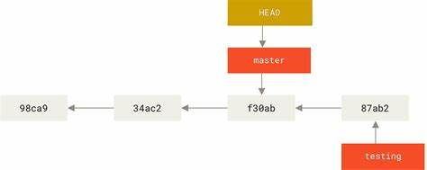
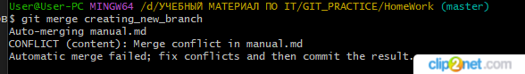
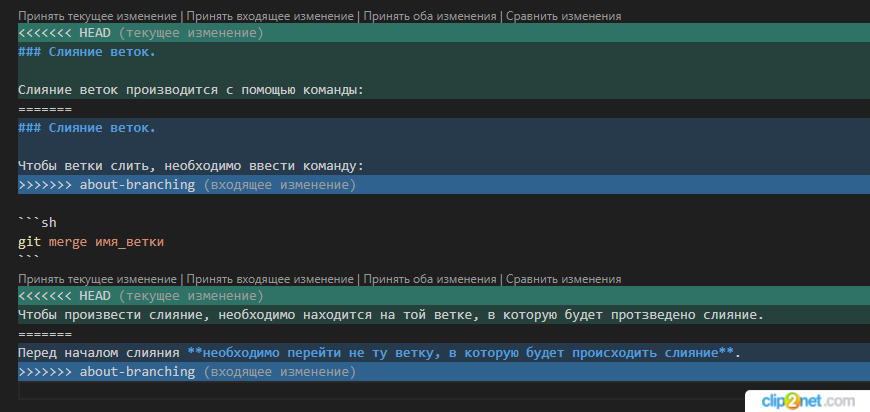
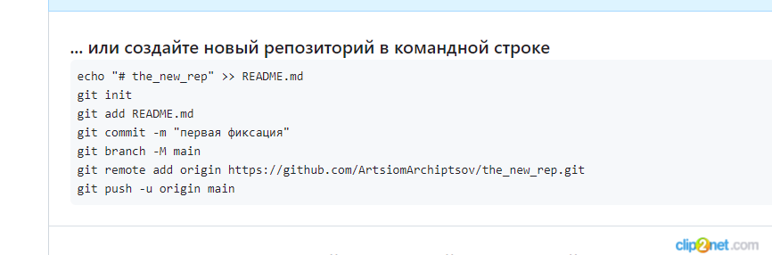

# Краткое руководство по спользованию **Git**.
## Что такое GitHub?
**GitHub** - это платформа для совместной работы, построенная поверх распределенной системы контроля версий под названием Git. GitHub ориентирован на разработчиков, людей, которые программируют и создают программное обеспечение. 
GitHub концентрируется на трех вещах:

* Создание технологической платформы, не похожей ни на одну другую, на которой разработчики могут создавать, распространять и развивать наилучший возможный код
* Создание сообщества разработчиков; безопасного места для совместной работы, которое облегчает обмен информацией, расширяет творческий потенциал и поддерживает принципы открытого исходного кода
* Предоставление доступа, открытие сообщества возможностей, где могут рождаться новые разработчики и где опытные разработчики могут оттачивать свои навыки и расширять свои знания.

<image src="./ScreenShots/github-icon.jpg" alt="Логотип GitHub">

Помимо того, что GitHub является местом размещения ваших Git-проектов и обмена ими, он предоставляет ряд функций, которые помогут вам и вашей команде более эффективно сотрудничать. К этим функциям относятся:

* Проблемы
* Запросы на извлечение
* Проекты
* Организации и команды

## Что такое **Git**?
**Git** - это приложение для контроля версий с открытым исходным кодом.
<br>**Git** - это:

* Распределенная система контроля версий (DVCS)
* Бесплатно и с открытым исходным кодом.
* Разработан для быстрого и эффективного выполнения любых проектов, от небольших до очень крупных
* Небольшой размер и быстрый

Git предлагает дешевое локальное разветвление, удобные промежуточные области и множество рабочих процессов.

**Ветви** - это важная концепция в Git.

Когда  создаетcя новая ветка в Git, на самом деле просто создается указатель, который соответствует самой последней фиксации в линии работы. Git хранит коммиты для каждой ветви отдельно, пока пользователь явно не скажете ему объединить эти коммиты в основное направление работы.
**Репозиторий** - это самый базовый элемент GitHub. Его проще всего представить в виде папки проекта. Однако, в отличие от обычной папки на ноутбуке либо ПК, репозиторий GitHub предлагает простые, но мощные инструменты для совместной работы с другими пользователями.

Репозиторий содержит все файлы проекта (включая документацию) и хранит историю изменений каждого файла. Независимо от того, проявляете ли вы простое любопытство или являетесь крупным участником, знание работы с репозиторием имеет важное значение!
### Учетные записи пользователей.
Когда вы зарегистрировались на GitHub, вам автоматически была предоставлена учетная запись пользователя. Разрешения для учетной записи пользователя просты: вы добавляете людей в качестве соавторов в определенные репозитории, чтобы предоставить им полный доступ на чтение и запись к проекту.
## Загрузка и установка **Git**.
Скачать и установить Git можно по адресу [www.git-scm.com](https://www.git-scm.com/)
### Выбор редакторов.
 Можно использовать практически любой текстовый редактор, но наибольшего успеха мы добились в следующем:

* [Код Visual Studio](https://code.visualstudio.com/)
* Блокнот
* Vi или Vim
* Возвышенно
* Блокнот++
* GitPad
## Начало работы в **Git**.
Сначала проверяем установися ли Git. Для этого проверяем его версию:
```sh
git --version
```
Если Git установлен, он вернет версию:

<image src="./ScreenShots/Clip2Net DropZone_240119232155.png">


После необходимо авторизоваться, чтобы избежать подобного сообщения:


Нужно ввести следующие команды:

```sh
git config --global user.email "почта_пользователя"
git config --global user.name "имя_пользователя"
```
После проведнной процедуры можно проверить прошла ли авторизация:
```sh
git config --global user.email 
git config --global user.name 
```
Если все прошло хзорошо, то должно на экран вывестись имя и почта пользователя.

## Создание Git-репозитория.

Вначале на каком-либол разделе жесткого диска необходимо создать папку.
Затем необходимо перейти к 
этой папке, используя терминал либо GitBash либо через Visual Studio Code.
<br>В командной строке вводится комадна:
* для Windows:
```sh
cd [раздел]:(путь)
```
* для Linux и MacOS:
```sh
pwd
```

Затем нужно ввести команду:
```sh
git init
```
Эта команда создаёт в текущем каталоге новый подкаталог с именем .git, содержащий все
необходимые файлы репозитория — структуру Git репозитория. На этом этапе ваш проект
ещё не находится под версионным контролем. 


## Определение статуса файлов.
Основной инструмент, используемый для определения, какие файлы в каком состоянии
находятся — это команда:
```sh
git status
```
Экран выведется сообщение:


Это означает, что у вас чистый рабочий каталог, другими словами — в нём нет
отслеживаемых изменённых файлов. Git также не обнаружил неотслеживаемых файлов, в
противном случае они бы были перечислены здесь:


## Отслеживание новых файлов.

Для того чтобы начать отслеживать (добавить под версионный контроль) новый файл,
используется:

```sh
git add имя_файла с расширением
```
## Коммит изменений.

Теперь, когда в индекс находится в таком состоянии, как вам и хотелось, вы можете
зафиксировать свои изменения.  
>**Всё, что до сих пор не
проиндексировано — любые файлы, созданные или изменённые вами, и для которых вы не
выполнили git add после редактирования — не войдут в этот коммит. Они останутся
изменёнными файлами на вашем диске.** 

Простейший способ зафиксировать изменения — это набрать:

```sh
git commit -m "Комментарий_к_индексу
```
Должно появиться такое сообение:


## Просмотр индексированных и неиндексированных изменений.

Чтобы увидеть, что же вы изменили, но пока не проиндексировали, наберите:
```sh
git diff
```
Эта команда сравнивает содержимое вашего рабочего каталога с содержимым индекса. Результат показывает ещё не проиндексированные изменения.

## Удаление файлов.

Для того чтобы удалить файл из Git, необходимо удалить его из отслеживаемых файлов
(точнее, удалить его из  индекса) а затем выполнить коммит. Это позволяет сделать
команда 
```sh
git rm
```
, которая также удаляет файл из  рабочего каталога, так что в
следующий раз вы не увидите его как «неотслеживаемый».

## Просмотр истории коммитов.

После того, было создано несколько коммитов или же клонирован репозиторий с уже
существующей историей коммитов, вероятно понадобится возможность посмотреть
что было сделано — **_историю коммитов_**. Одним из основных и наиболее мощных
инструментов для этого является команда:
```sh
git log
``` 
На экран выведется следующее сообщение:


По умолчанию (без аргументов) __git log__ перечисляет коммиты, сделанные в репозитории в
обратном к хронологическому порядке — последние коммиты находятся вверху. Из примера
можно увидеть, что данная команда перечисляет коммиты с их SHA-1 контрольными
суммами, именем и электронной почтой автора, датой создания и сообщением коммита.

Также можно вывести коммиты в сокращенном виде:
```sh
git log --oneline
```

Появится следующее сообщение:


>  Главная ветка называется - **master**

>  **_HEAD -> master_** - последний сохраненный коммит

## Операции отмены.

### Отмена изменений в файле.

Для того чтобы отменить измения в файле, либо вернуть к начальному состоянию до изменений, нужно ввести следующее:

```sh
git checkout SHA-1_контрольная_сумма (либо ее сокращенное сотояние)
```
Чтобы вернуть все обратно, нужно набрать:
```sh
git checkout master
```

### Отмена действий с помощью _git restore_.

* Oтмена идексации:

```sh
git restore --staged <файл>
```

*  Откат измененного файла:
```sh
git restore <файл>
``` 
## Игнорирование файлов.

Зачастую,  имеется группа файлов, которые вы не только не хотите автоматически
добавлять в репозиторий, но и видеть в списках неотслеживаемых. К таким файлам обычно
относятся автоматически генерируемые файлы (различные логи, результаты сборки
программ и т. п.). В таком случае, вы можете создать файл **_.gitignore_**. с перечислением
шаблонов соответствующих таким файлам. Вот пример файла **_.gitignore_**:

```sh
$ cat .gitignore
*.[oa]
*~
```
Первая строка предписывает Git игнорировать любые файлы заканчивающиеся на **«.o»** или
**«.a»** — объектные и архивные файлы, которые могут появиться во время сборки кода. Вторая
строка предписывает игнорировать все файлы заканчивающиеся на тильду **(~)**, которая
используется во многих текстовых редакторах, например Emacs, для обозначения
временных файлов. Вы можете также включить каталоги log, tmp или pid; автоматически
создаваемую документацию; и т. д. и т. п. Хорошая практика заключается в настройке файла
**_.gitignore_** до того, как начать серьёзно работать, это защитит вас от случайного добавления
в репозиторий файлов, которых вы там видеть не хотите.

К шаблонам в файле .**_gitignore_** применяются следующие правила:
* Пустые строки, а также строки, начинающиеся с **#**, игнорируются.
* Стандартные шаблоны являются глобальными и применяются рекурсивно для всего
дерева каталогов.
* Чтобы избежать рекурсии используйте символ слеш **(/)** в начале шаблона.
* Чтобы исключить каталог добавьте слеш **(/)** в конец шаблона.
* Можно инвертировать шаблон, использовав восклицательный знак **(!)** в качестве
первого символа.

Glob-шаблоны представляют собой упрощённые регулярные выражения, используемые
командными интерпретаторами. Символ (*) соответствует 0 или более символам;
последовательность [abc] — любому символу из указанных в скобках (в данном примере a, b
или c); знак вопроса (?) соответствует одному символу; и квадратные скобки, в которые
заключены символы, разделённые дефисом ([0-9]), соответствуют любому символу из
интервала (в данном случае от 0 до 9). Вы также можете использовать две звёздочки, чтобы
указать на вложенные каталоги: a/**/z соответствует a/z, a/b/z, a/b/c/z, и так далее.

## Индексация изменных файлов.

Когда оба файла проиндексированы и войдут в следующий коммит. В этот момент вы,
предположим, вспомнили одно небольшое изменение, которое вы хотите сделать в
CONTRIBUTING.md до коммита. Вы открываете файл, вносите и сохраняете необходимые
изменения и вроде бы готовы к коммиту. Но давайте-ка ещё раз выполним git status:
```sh
$ vim CONTRIBUTING.md
$ git status
On branch master
Your branch is up-to-date with 'origin/master'.
Changes to be committed:
  (use "git reset HEAD <file>..." to unstage)
  new file: README
  modified: CONTRIBUTING.md
Changes not staged for commit:
  (use "git add <file>..." to update what will be committed)
  (use "git checkout -- <file>..." to discard changes in working directory)
  modified: CONTRIBUTING.md
```
Что за чёрт? Теперь CONTRIBUTING.md отображается как проиндексированный и
непроиндексированный одновременно. Как такое возможно? Такая ситуация наглядно
демонстрирует, что Git индексирует файл в точности в том состоянии, в котором он находился, когда вы выполнили команду **_git add_**. Если вы выполните коммит сейчас, то
файл CONTRIBUTING.md попадёт в коммит в том состоянии, в котором он находился, когда вы
последний раз выполняли команду **_git add_** , а не в том, в котором он находится в вашем
рабочем каталоге в момент выполнения **_git commit_**. Если вы изменили файл после
выполнения **_git add_**, вам придётся снова выполнить **_git add_**, чтобы проиндексировать
последнюю версию файла:

```sh
$ git add CONTRIBUTING.md
$ git status
On branch master
Your branch is up-to-date with 'origin/master'.
Changes to be committed:
  (use "git reset HEAD <file>..." to unstage)
  new file: README
  modified: CONTRIBUTING.md

```
## Ветвление в Git.

### Что такое ветление?

Git не хранит данные в виде последовательности
изменений, он использует набор снимков (snapshot).
<br>Git сохраняет его в виде объекта, который содержит указатель на
снимок (snapshot) подготовленных данных. Этот объект так же содержит имя автора и
email, сообщение и указатель на коммит или коммиты непосредственно предшествующие
данному (его родителей): отсутствие родителя для первоначального коммита, один
родитель для обычного коммита, и несколько родителей для результатов слияния двух и
более веток.
<br>Предположим, у вас есть каталог с тремя файлами и вы добавляете их все в индекс и
создаёте коммит. Во время индексации вычисляется контрольная сумма SHA-1 каждого файла, затем каждый файл сохраняется в репозиторий (Git
называет такой файл ***блоб*** — **большой бинарный объект**), а контрольная сумма попадёт в
индекс.
<br>Когда вы создаёте коммит командой **git commit**, Git вычисляет контрольные суммы каждого
подкаталога и сохраняет его в
репозитории как объект дерева каталогов. Затем Git создаёт объект коммита с
метаданными и указателем на основное дерево проекта для возможности воссоздать этот
снимок в случае необходимости.
<br>Репозиторий Git теперь хранит пять объектов: три блоб объекта (по одному на каждый
файл), объект дерева каталогов, содержащий список файлов и соответствующих им блобов,
а так же объект коммита, содержащий метаданные и указатель на объект дерева
каталогов.



Если сделаетm изменения и создадитm ещё один коммит, то он будет содержать указатель
на предыдущий коммит.

.jpg> "Коммит и его родители")
<br>***Ветка в Git*** — это простой перемещаемый указатель на один из таких коммитов. По
умолчанию, имя основной ветки в Git — **master**. Как только вы начнёте создавать коммиты,
ветка **master** будет всегда указывать на последний коммит. Каждый раз при создании
коммита указатель ветки **master** будет передвигаться на следующий коммит автоматически.
>***Ветка «master»*** в Git — это не какая-то особенная ветка. Она точно такая же,
как и все остальные ветки. Она существует почти во всех репозиториях
только лишь потому, что её создаёт команда **git init**, а большинство людей не меняют её название.

 
### Создание веток.

При создании ветки всего лишь создаётся новый
указатель для дальнейшего перемещения. Допустим вы хотите создать новую ветку с
именем *testing*. Вы можете это сделать командой **git branch** - эта команда выведит на экран все имеющиеся ветки:

```sh 
git branch
```
Для создания новой ветки нужно воспользоваться командой:

```sh
git branch <имя_ветки(имя-ветки и т.д.)>
```
>**При написании имени ветки пробелы недопустимы.**

В результате создаётся новый указатель на текущий коммит.

.jpg> "Две ветки указывают на одну и ту же последовательность коммитов")

Как Git определяет, в какой ветке вы находитесь? Он хранит специальный указатель **HEAD**.
 В Git **HEAD** — это указатель
на текущую локальную ветку. 

.jpg>   "HEAD указывает на ветку")

При помощи простой команды **git log**, которая покажет вам
куда указывают указатели веток. Эта опция называется **--decorate**:

```sh
git log --oneline --decorate
```


### Переключение веток.

Для переключения на существующую ветку выполните команду:

```sh
git checkout имя_ветки
```

В результате указатель **HEAD** переместится на ветку **testing**.

.jpg> "HEAD указывает на текущую ветку")

Cделаем ещё один коммит:

.jpg> "Указатель на ветку HEAD переместился вперёд после коммита")

*Интересная ситуация*: указатель на ветку **testing** переместился вперёд, а **master** указывает
на тот же коммит, где вы были до переключения веток командой **git checkout**. Давайте
переключимся назад на ветку **master**:


```sh
git checkout master
```

>***git log*** *не показывает все ветки по умолчанию*.

Если выполнить команду **git log** прямо сейчас, то в её выводе только что
созданная ветка **«testing»** фигурировать не будет.
<br>Ветка никуда не исчезла; просто Git не знает, что именно она вас интересует,
и выводит наиболее полезную по его мнению информацию. Другими
словами, по умолчанию **git log** *отобразит историю коммитов только для
текущей ветки*.
Для просмотра истории коммитов другой ветки необходимо явно указать её
имя:

```sh
 git log имя_ветки
 ```
 Чтобы посмотреть историю по всем
веткам — выполните команду с дополнительным флагом:

```sh
 git log --all
 ```

 

 Эта команда сделала две вещи: переместила указатель **HEAD** назад на ветку master и вернула
файлы в рабочем каталоге в то состояние, на снимок которого указывает master. Это также
означает, что все вносимые с этого момента изменения будут относиться к старой версии
проекта. Другими словами, вы откатили все изменения ветки testing и можете продолжать
в другом направлении.

>*Переключение веток меняет файлы в рабочем каталоге*
<br>Важно запомнить, что при переключении веток в Git происходит изменение
файлов в рабочем каталоге. Если вы переключаетесь на старую ветку, то
рабочий каталог будет выглядеть так же, как выглядел на момент
последнего коммита в ту ветку. Если Git по каким-то причинам не может
этого сделать — он не позволит вам переключиться вообще.

<br>Все описанные действия можно визуализировать с помощью команды **git log**. Для
отображения истории коммитов, текущего положения указателей веток и истории
ветвления выполните команду:

```sh
 git log --oneline --decorate --graph --all
```

*Одновременное создание новой ветки и переключение на неё*
<br>Как правило, при создании новой ветки вы хотите сразу на неё
переключиться — это можно сделать используя команду:

```sh
 git checkout -b имя_ветки
 ```

 Начиная с Git версии 2.23, вы можете использовать **git switch** вместо **git
checkout**, чтобы:
* Переключиться на существующую ветку: 

```sh
git switch имя_ветки
```

* Создать новую ветку и переключиться на неё:

```sh
 git switch -c имя_ветки
 ```

Флаг **-c** означает создание, но также можно использовать полный
формат:
```sh 
--create
```

* Вернуться к предыдущей извлечённой ветке: 

```sh
git switch -
```

### Cлияние веток.

Чтобы ветки слить, необходимо ввести команду:

```sh
git merge имя_ветки
```

В данном случае
процесс разработки ответвился в более ранней точке. Так как коммит, на котором мы
находимся, не является прямым родителем ветки, с которой мы выполняем слияние, Git
придётся немного потрудиться. В этом случае Git выполняет простое трёхстороннее
слияние, используя последние коммиты объединяемых веток и общего для них
родительского коммита.

.jpg> "Использование трёх снимков при слиянии")

Вместо того, чтобы просто передвинуть указатель ветки вперёд, Git создаёт новый
результирующий снимок трёхстороннего слияния, а затем автоматически делает коммит.
Этот особый коммит называют коммитом слияния, так как у него более одного предка.

.jpg> "Коммит слияния")

Теперь, когда изменения слиты, ветка больше не нужна. Вы можете закрыть задачу в
системе отслеживания ошибок и удалить ветку:

```sh
git branch -d имя_ветки
```

### Основные конфликты слияния.

Иногда процесс не проходит гладко. Если вы изменили одну и ту же часть одного и того же
файла по-разному в двух объединяемых ветках, Git не сможет их чисто объединить. Если
ваше исправление ошибки в одной ветке потребовало изменить ту же часть файла что и в дргой ветке, вы
получите примерно такое сообщение о конфликте слияния:



Git не создал коммит слияния автоматически. Он остановил процесс до тех пор, пока вы не
разрешите конфликт. Чтобы в любой момент после появления конфликта увидеть, какие
файлы не объединены, вы можете запустить **git status**.
<br>Всё, где есть неразрешённые конфликты слияния, перечисляется как неслитое. В
конфликтующие файлы Git добавляет специальные маркеры конфликтов, чтобы вы могли
исправить их вручную. В вашем файле появился раздел, выглядящий примерно так:



Это означает, что версия из **HEAD** (вашей ветки **master**, поскольку именно её вы извлекли
перед запуском команды слияния) — это верхняя часть блока (всё, что над =======), а версия
из вашей ветки **about-branching** представлена в нижней части. Чтобы разрешить конфликт, придётся
выбрать один из вариантов, либо объединить содержимое по-своему. Например, вы можете
разрешить конфликт, приняв текущее изменение.

## Работа с удаленным репозиторием в GitHub.

#### Передача репозитрия на GitHub.

1.  В GitHub создаем репозиторий.


2. Даем ему название. 


3. Далее жмем кнопку создать репозиторий.


4. Следуем инструкции, которую предлагает GitHub.



### Рабочий процесс с использованием GitHub.

GitHub разработан с прицелом на определённый рабочий процесс с использованием
запросов на слияния. Этот рабочий процесс хорошо подходит всем: и маленьким,
сплочённым вокруг одного репозитория, командам; и крупным распределённым
компаниям, и группам незнакомцев, сотрудничающих над проектом с сотней копий.
Рабочий процесс GitHub основан на тематических ветках.

Вот как это обычно работает:
1. Создайте форк проекта.
2. Создайте тематическую ветку на основании ветки **master**.
3. Создайте один или несколько коммитов с изменениями, улучшающих проект.
4. Отправьте эту ветку в ваш проект на GitHub.
5. Откройте запрос на слияние на GitHub.
6. Обсуждайте его, вносите изменения, если нужно.
7. Владелец проекта принимает решение о принятии изменений, либо об их отклонении.
8. Получите обновлённую ветку **master** и отправьте её в свой форк.

### Создание запроса на слияние

Для того чтобы "склонировать" файл с GitHub на локальный диск, нужно провести следующую операцию:
1. Определяем директорию, в которой будет храниться наш репозиторий:

```sh
cd <каталог>
```


2. Командой **git status** проверяем наличие в паке иных репозиториев.


3. Заходим в GitHub на страницу того репозитория, который нужно "склонировать". Копируем адресс, нажав кнопку "Code".


4. Вводим в терминале команду **git clone**:

```sh
git clone <URL-address>
```


5. Cнова командой git status проверяется наличие репозитория.

6. Командой **cd** подтверждаем что данный папка является репозиторием.

7. Снова воспользуемся командой **git status**, где смотрим является ли наш репозиторий активным.

8. Проводим изменения в репозитории и сохраняем изменения.
 
9. Отправляем изменения на сервер:
 ```sh
  git push --set-upstream origin <branch_name>
  ```
10. Заходим на GitHub ти жмем кнопку "Compare and pull request".

  

### Прочие команды.

* Просмотр адресов, к которым привязан репозиторий:

```sh
git remote -v
```

* Удаление удаленно ветки с GitHub:

```sh
git push --delete <имя_ветки>
```

* Расширеная информация:

```sh
git remote show
```

* Cохранение и создание коммита одновременно:

```sh
git commit -a "название"
```

* "Вытягивание" информации с удаленного репозитория:

```sh 
git pull
```

### Создание pull request.

1. Заходим на GitHub туда, где хотим сделать **pull request**. Нажэимаем кнопку "Fork".


2. Затем жмем кнопку **"Creat Fork"**


Должно высчветиться окно 


3. Cоздаем папку (каталог) для нашего репозитория, употребив команду **cd**.

4. Командой **git status** проверяем наличие какого-нибудь репозитория в этой папке.

5. Командой **git clone** клонируем репозиторий на локальный диск.

6. Снорва проверяем наличие репозитория в папке командой **git status**.

7. Cоздаем ветку:

```sh 
git checkout -b <branch_name>
```
